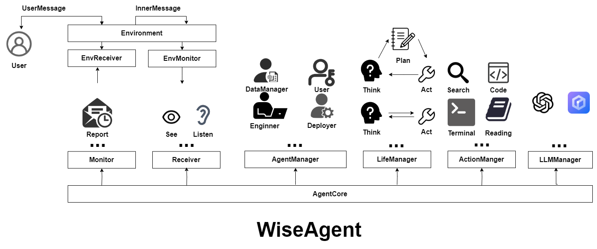

# WiseAgent

[](https://opensource.org/licenses/MIT)

## Overview


`WiseAgent` 是一个基于大模型智能体的框架，旨在发掘单智能体的持续学习能力和多智能体之间的协同进化智能体。它提供了包括智能体感知、规划、记忆、执行、交互环境及基于记忆的知识抽取等功能，用于开发和部署能够随着时间的推移适应和改进的智能体社区。

## Features

- **Single-Agent Support**: 支持单个智能体和多个智能体的环境。方便开发者快速上手，同时也能满足复杂场景的需求。
- **Multi-Agent Support**: 支持多个智能体之间的交互和协作，促进智能体之间的知识共享和策略优化。

- **Continuous Learning**: 智能体能够从环境中学习，并在与环境的交互中不断改进其策略。
- **Scalconfig**: 框架设计考虑了可扩展性，可以轻松处理大量智能体和复杂的环境。在性能和资源消耗中进行平衡，以实现高效的多智能体交互。
- **Flexible Architecture**: 框架采用模块化设计，允许开发者根据需要自定义和扩展智能体和环境。提供丰富的接口和工具，方便开发者进行二次开发。

## Installation

要安装 `WiseAgent`，需使用 pip：

```bash
pip install -e .
```

## Usage

1. 配置模型文件`config/env.yaml`
    ```yaml
    LLM:
        type: 模型类型，示例："openai"
        api_key: "模型的API key" 
        base_url: "模型的base_url"
        model_name: "模型的名称"
        verbose: "是否打印模型输出，示例：True"

    EMBEDDING:
        illustration: "EMBEDDING是可选的，可以不配置"
        type: 模型类型，示例："openai"
        api_key: "模型的API key" 
        base_url: "模型的base_url"
        model_name: "模型的名称"


    ```

2. 以下是一个快速示例，帮助你入门, 这个脚本可以在`example/run_agent/run_engineer.py` 中找到。

    ```python
    from wiseagent.action.normal_action.write_code import WriteCodeAction
    from wiseagent.core.agent import Agent

    def get_user_input(engineer):
        while True:
            user_input = input("Please input your task:")
            if user_input == "exit":
                break
            # 让智能体根据用户输入执行动作
            engineer.ask(user_input)

    def main():
        # 创建一个智能体
        engineer = Agent.from_default(name="Bob",description="Bob is a engineer")
        # 注册一个动作/工具
        engineer.register_action(WriteCodeAction())
        # 让智能体开始工作
        engineer.life()
        # 获取用户输入并执行动作
        get_user_input(engineer)
        
    if __name__ == "__main__":
        main()
    ```

3. 除此之外，也可以通过配置.yaml 配置文件来创建智能体和动作。

    ```yaml
    name : "(必填)智能体的名字，示例:Bob" 
    description : "(选填)智能体的描述"

    action_list :
    - "MethodPlanAction"
    - "行为列表，表示行为类，其中 MethodPlanAction 规划行为是必须的。"
    - "其他的一些行为包括 ArxivAction,WriteCodeAction等,可以在wiseagent\action\normal_action中找到。"

    life_schedule_config: "(必填)执行模式，示例：ReActLifeSchedule"
    ```
    具体的示例可以在`example` 中找到。

    ```python
    from wiseagent.core.agent import Agent

    def get_user_input(engineer):
        while True:
            user_input = input("Please input your task:")
            if user_input == "exit":
                break
            # 让智能体根据用户输入执行动作
            engineer.ask(user_input)
    def main():
        agent:Agent = Agent.from_yaml_file(yaml_file)
        # 让智能体开始工作
        agent.life()
        # 获取用户输入并执行动作
        get_user_input(agent)

    if __name__ == "__main__":
        main()
    ```
4. 启动智能体网页端和服务端
    服务端
    ```bash
    python wiseagent\server\server.py
    ```
    网页端
    ```bash
    streamlit run wiseagent\web\web_page.py
    ```
    
更多详细的使用示例和高级用法，请参考[文档](#documentation)。
## Documentation


更多的开发者文档，请参考[开发者文档](#developer-documentation)。

## Contributing

我们欢迎社区贡献！如果您想为 WiseAgent 贡献代码，请按照以下步骤操作：

1. Fork 仓库。
2. 创建一个新的分支 (`git checkout -b feature/your-feature-name`)。
3. 进行更改并提交 (`git commit -am 'Add some feature'`)。
4. 推送到分支 (`git push origin feature/your-feature-name`)。

## License


`WiseAgent` 遵循 MIT 许可证。有关详细信息，请参阅 [LICENSE](LICENSE) 文件。

## Contact


如果你有任何问题或需要支持，请随时与联系我们。

---
如果你喜欢这个项目，请给一个 star 吧！


