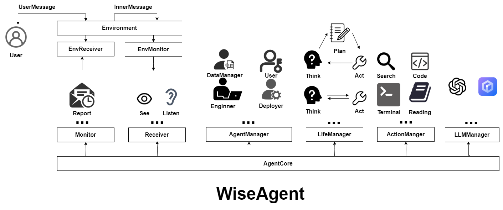
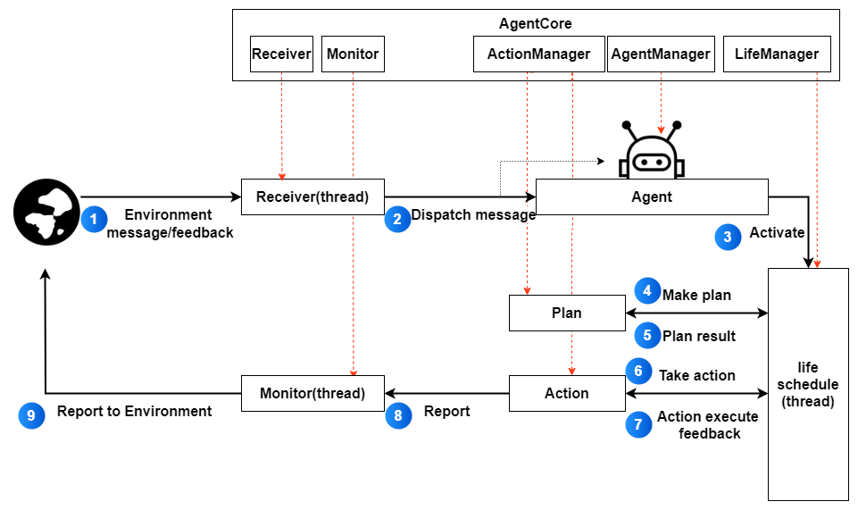

# 开发指南
[English](./development_guide_en.md)

[TOC]

## 1. 简介
## 1.1. 架构

WiseAgent 是一个多智能体框架，模块设计如上图所示。\
在Core中包含以下对象：
- `LLMManger` 负责管理大模型调用。
- `AgentManager` 负责管理所有的智能体。在`WiseAgent`中智能体之间的差异存在于智能体的数据上。由于背景提示词，行为配置，生命周期配置，感知器和记忆数据不同，形成了不同的智能体。所以归结到底，`AgentManager`本质上实现了对智能体的专有数据的历。
- `LifeManager` 负责管理不同的生命周期逻辑，比如`React`，`Act`等。
- `ActionManager` 实现了对行为的管理
- `Monitor` 是监视器，能够捕获在智能体内部上报的内容，比如智能体的思考，执行结果等。注意，监视器不是必须的，没有监视器智能体依旧能够完成任务，但是从外部感知不到智能体的思考等操作。
- `Receiver` 是接收器，从外部环境中感知输入并分发给对应的智能体。
- `AgentCore` 是`WiseAgent`的组织核心。所有的模块都绑定在`AgentCore`上，可以近似理解为`AgentCore`是`WiseAgent`的容器。同时实现了get_agent_core()方法，这个方法可以在执行的时候，在任何地方动态的获取到`AgentCore`，从而获取到系统任何一个功能。尽管这种方式可能会造成数据访问权限和安全问题，但我们认为，这种方式能够最大化智能体编程的灵活性，更能解放智能体的自我编程时的创造力。

此外还有一个环境模块
- `Environment` 模块的感知器和接收器和`AgentCore`中的模感知器和接收器刚好相反，智能体的输入是环境的输出，而环境的输入是智能体的输出。`Environment`模块是智能体和外部环境之间的桥梁（不是唯一桥梁，在行为执行的时候也会影响环境）。\
这种设计方式更加便于后续的前后端的设计，因为action的执行结果会直接反馈到环境，但在前后端逻辑中，Agent执行改变的是服务器的环境，而不是用户端的环境，所以需要上报Agent的执行，并在用户端同步再执行一次。\
环境也是`WiseAgent` 实现多智能体交互的基础，因为`WiseAgent`中的智能体之间没有直接的数据交互，所有的交互都是通过环境来实现的。这种方式更加符合现实中的多智能体交互，因为现实中的多智能体交互也是通过环境来实现的。


## 1.2.智能体执行流程

智能体执行流程：\
1. 环境的的消息，会发送给接收模块。接收模块相当于一个中转站。
2. 当接收接收到消息后，会根据消息中的智能体名称，找到对应的智能体，并将消息发送给智能体。(如果没有对应的智能体，消息会在接收中暂存，可配置）
3.智能体将消息写入短期记忆列表。如果生命线程阻塞，则唤醒生命线程响应环境的输入。
4. 生命线程唤醒后，会根据智能体的配置，调用规划行为。
5. 规划行为会根据智能体的短期记忆列表，调用大模型，生成一个规划。反馈给智能体。
6. 智能体根据规划执行行为
7. 行为执行的结果，会给一个成功执行的及时反馈
8. 行为执行的结果，会被独立的监视线程捕获。
9. 监视线程将捕获的结果，向环境报告。


## 1.2. 代码结构
```
├── wiseagent
|   ├── core # 核心模块
|   |   ├── life_schedule         # 生命周期模块
|   |   ├── llm                   # llm模块
|   |   ├── agent_core.py         # 框架核心组织模块
|   |   ├── agent.py              # 智能体
|   |   ├── life_manager.py       # 生命周期管理
|   |   ├── llm_manager.py        # 模型管理
|   |   ├── base_monitor.py       # 监视器：监视框架内部的输出
|   |   └── receiver.py           # 接收器：节后从环境的输入 
│   ├── action # 行为模块
|   |   ├── memory_action         # 记忆行为模块
|   |   ├── plan_action           # 规划模块
|   |   ├── normal_action         # 普通行为模块
│   |   ├── action_manager        # 行为管理器
│   |   ├── action_decorator.py  # 行为注解
|   |   └── base_action.py        # 行为基类
|   ├── common # 公共模块 
|   |   ├── const.py              # 常量
|   |   ├── utils.py              # 工具
|   |   └── ...
│   ├── env # 环境模块
|   |   ├── editor_env.py         # 文本环境 
|   |   └── multi_agent_env.py   # 多智能体环境
|   ├── server # 服务器模块
|   |   └── server.py             # 服务器
|   ├── web # 网页模块
|   |   └── web.py                # 网页

```

## 2. 配置

智能体配置文件示例可以在目录`example\agent_yaml`下。
### 2.1. 基本配置包括：
```yaml
name : "Bob"
description : "Bob like to chat with people. And he is a good listener."

action_list :
  - "MethodPlanAction"
  - "ArxivAction"
  - "Chat:chat"

life_schedule_config: "ReActLifeSchedule"
```

其中`action_list` 是智能体能够调用的行为。 \
对应具体的行为类名，可以在源代码目录`wiseagent\action`及其子文件下找到相关的类 \
`MethodPlanAction` 是智能体产生规划的方法，目前只支持这种方法，必填。 \
`ArxivAction` 是智能体产生阅读文献的行为，为了能够让智能体浏览Arxiv网站，并利用网站的检索功能获取相关论文 \
`Chat` 是智能体产生聊天行为。 
> 有时候并不希望智能体能够使用行为类中的所有行为，此时，只需要在行为类名后面加上`:`和具体的行为名即可。例如，`Chat:chat`表示智能体能够调用`Chat`类中的`chat`方法。


`life_schedule_config` 是智能体生命周期的调度器，目前只支持`ReActLifeSchedule`，必填。\
`HumanLifeSchedule`(开发中):  每个行为能够根据当前状态自启动，模拟人根据环境状态自我唤醒的过程，适合定时反思，社交模拟等内部自管理的智能体

### 2.2. 扩展配置：
- 独立API：
考虑到在多智能体系统中，不同的智能体可能需要调用不同的API，因此我们为智能体设计了独立的API的配置。如果未填，将使用全局配置。\
    ```yaml
    llm_config:
    type: "openai" 
    api_key: "sk-xxxxx"
    base_url: "https://api.openai.com/v1"
    model_name: "Turbo-16k"
    verbose: True
    ```
- 行为配置数据：
    有时候，不同的智能体虽然行为相同，但是行为的数据有时候是不相同的，所以设计了智能体能够携带的数据。
    ```yaml
    action_data_config:
    action_name:
        data_name: "data"
    ```
    举一个具体的例子，在MethodPlanAction中，设计了两种解析指令的方式，一种是使用`XML`，一种是使用`JSON`。默认情形下使用`XML`，如果智能体需要使用`JSON`，则需要在配置文件中添加如下配置。\
    同时，不同的智能体的规划示例存在差异，example将以行为配置的方式传入.
    ```yaml
    action_data_config :
        "MethodPlanAction": 
            "parse_type": "json"
            "experience": |
            Thought:I need to Write a 2048 game.
            ```json
            [
                {
                    "action_name": "Chat",
                    "action_method": "chat",
                    "args": {
                        ...
                    }
                },
                {
                    "action_name": "WriteCodeAction",
                    "action_method": "write_code",
                    "args": {
                        ...
                        }
                } 
            ]
    ```
    ```
    具体的示例可以参考`example\agent_yaml\engineer_agent.yaml`
    ```
- WiseAgent 全局系统配置
    ```yaml
    reporter_module_path: []

    # Life Schedule
    life_scheduler_module_path:
    - "wiseagent.core.life_scheduler.autostart_life_scheduler"
    - "wiseagent.core.life_scheduler.human_life_scheduler"
    - "wiseagent.core.life_scheduler.react_life_scheduler"

    # Action
    action_module_path : 
    - "default"

    base_action_class:
    - "BaseAction"
    - "BasePlanAction"
    # LLM

    llm_module_path:
    - "wiseagent.core.llm.openai"
    - "wiseagent.core.llm.baichuan"
    ```
    由于WiseAgent的核心模块是动态加载的，所以需要配置各个模块的路径。 其中`action_module_path`中若存在`default`参数，将会自动加载`wiseagent\action`目录下的所有行为。
    行为检测的依据是行为类是否直接继承于`base_action_class`(配置)中的父类。
    > 需要强调的是，为了能够更节约资源，并不会在初始化的时候对`action_module_path`中的模块进行加载。在初始化的时候会进行代码的文本扫描，然后根据`base_action_class`中的父类进行行为类的检测。如果检测到行为类，则记录。在智能体初始化的时候，会根据记录的行为类进行加载。\
    会在[自定义行为](#32-自定义行为)中进行说明。
## 3. 智能体

### 3.1. 智能体基本设计
  `WiseAgent` 行为设计方式遵循：
$$共享行为(\text{ActionClass}) + 专有数据(\text{ActionData}) = 专有行为(\text{PersonalAction})$$

- 共享行为，确保每一个行为类在系统中都是可重复使用的单例模式。
- 专有数据，使用`python`的上下文管理器，使得在行为逻辑的任何地方调用`get_action_data` 都可以获得当前调用行为的智能体的数据
- 专有行为，通过共享行为和专有数据，使得智能体能够根据自身的数据，产生不同的行为表现。

### 3.2. 智能体初始化
- 智能体读取配置文件
- 智能体初始化
    - 智能体基本数据初始化
    - 智能体行为数据初始化
    - 智能体状态初始化

### 3.3. 智能体的感知器
- 智能体的感知器
  - 内部感知
  - 外部感知
### 3.4. 智能体的记忆器
- 记忆器的基本设计
- 记忆器的使用方式
- 记忆器的数据结构
- 记忆器的reflect
- 记忆器的knowledge_extraction

### 3.5 智能体的规划器
- 规划器的基本设计
- 规划器的使用方式
- 规划器的数据结构
### 3.6. 智能体的执行器
- 执行器的基本设计
- 执行器的使用方式
- 执行器的数据结构
### 3.3. 智能体生命周期调度器
- 具体流程图
- 具体流程说明
- 具体流程示例


## 4. 行为
本节主要介绍智能体行为的设计，包括基本行为，自定义行为，多智能体行为。
### 4.1. 行为基本介绍

行为是智能体能够执行的最小单元。智能体在规划的过程中，会根据当前状态产生行为流程，然后检测行为流程中的行为是否能够执行，最后执行行为。进而影响环境或智能体自身的状态（如反思）。
>在`WiseAgent`中，区别了行为和工具。\
工具的编写不受任何的限制，只要能够实现行为所需要的功能即可。\
行为的编写为了能够更好地被`WiseAgent`所调用，需要实现一些具体的方法。

- 行为的执行流程
  1. 全局初始化阶段：在该阶段，行为会根据智能体配置文件中的配置进行初始化。只记录行为名称，并不载入具体的行为类。
  2. 局部初始化阶段：加载行为的是智能体初始化的一个阶段。在这个阶段，会检测并加载智能体需要的行为类，并调用行为类中的`init_agent`进行针对智能体的特异化行为配置，比如'WechatAction'需要配置智能体的微信账号信息。
  3. 行为调用前检测：在行为调用前，会检测行为是否能够执行。传入的参数是当前的执行行为序列，包括已完成和未完成的行为。在某些情况下，由于行为之间的互斥，希望在某些行为执行前，能够检测到行为之间的冲突，从而避免冲突行为同时执行。这里提供了一种利用规则修改行为序列的机制。比如希望在智能体停止（调用end函数）前，检测一下是否所有计划都完成了，如果没有完成，则不应该停止，而是应该继续执行计划。
  4. 行为调用阶段：在该阶段，行为会根据传入的参数进行行为调用。行为调用阶段是行为执行的核心阶段，行为会根据传入的参数进行行为调用，并返回行为调用结果。
  5. 在`WiseAgent`进程结束前，调用`close`做最后的保存和释放资源的操作。


- 内置行为

    |行为名称|行为类名|功能|
    |----|---|----|
    |规划行为|MethodPlanAction|智能体产生规划的方法|
    |Arxiv行为|ArxivAction|智能体产生阅读文献的行为|
    |交流行为|Chat|智能体产生聊天行为|
    |写代码行为|WriteCodeAction|智能体产生写代码行为|
    |长文档撰写行为|LongDocumentGenerateAction|智能体产生长文档撰写行为|
    |终端控制行为|TerminalAction|利用终端进行操作|
    |notebook脚本行为|JupyterNotebookAction|生成可交互的python脚本|
    |微信操控行为(不推荐使用)|WechatAction|利用微信进行操作|

### 4.2. 自定义行为
本小节主要介绍如何自定义行为。在`WiseAgent`中，行为分为两种，一种为普通行为，另一种为计划行为。普通行为完成具体的任务，而规划行为完成

#### 4.2.1. 行为代码编写
- 行为类基本编写规范
  
    示例:
    ```python
    from wiseagent.action.base_action import BaseAction, action
    from wiseagent.action.base_action_data import BaseActionData
    from wiseagent.common.singleton import singleton

    class MyActionData(BaseActionData):
        """行为数据"""

        def __init__(self, agent_data: Agent):
            super().__init__(agent_data)
            self.my_data = "my_data"
    
    @singleton
    class MyAction(BaseAction):
        """行为"""

        def init_agent(self):
            """初始化行为"""
            self.set_action_data(MyActionData(agent_data))

        @action()
        def my_action(self, args: dict):
            """我的行为
            Args:
                args: dict
            """
            ...
            return "my action has been executed"
    ```
    - 行为类需要继承于`BaseAction`或`BasePlanAction`，其中`BaseAction`是普通行为，`BasePlanAction`是计划行为。
    - 行为类需要实现`init_agent`方法，用于初始化行为。在该方法中，可以配置行为需要的工具和参数。
        >为了隔离不同智能体之间的配置，强烈建议将行为数据封装在`BaseActionData`的子类中，并在`init_agent`方法中进行初始化。\
        调用`BaseAction`的`set_action_data`方法进行行为数据的设置。\
        在需要的时候调用`get_action_data`方法获取行为数据。
    - 使用`@action`装饰器装饰行为函数。这个装饰器会自动将行为函数注册到行为类中。智能体在规划的时候，就能够直接识别出被装饰的函数，从而能够调用行为函数。
    - 为每一个行为函数编写注释，用于描述行为函数的功能和参数。这些注释被用于让智能体理解行为的功能和调用方法。
    - (可选)`close` 函数，用于在行为类被销毁前进行一些清理工作。
-  `BaseAction`中实现了对`llm`的调用，可以直接调用`self.llm_ask`进行大模型的调用。\
参数说明：
    - `prompt`：大模型输入的prompt
    - (可选)`memory`：大模型输入的memory, 注意当为`None`时，会自动调用`self.get_memory`获取记忆
    - (可选)`system_prompt`：大模型输入的system_prompt,注意当为`None`时，不会添加额外的system_prompt。
    - (可选)`handle_stream_function`：大模型输出流处理函数。在一些需要及时反馈的场景下，可以传入该函数，用于处理大模型的输出流。


#### 4.2.2. 行为高级编程
- 消息上报
- 流式输出
- 行为调用前检测

## 5. 消息
- 消息数据格式
- 模型消息类型
- 处理消息类型
- 消息上报
- 消息流式输出
## 5.1. 消息数据格式
## 5.2. 模型消息类型
## 5.3. 处理消息类型
## 5.4. 消息上报
## 5.5. 消息流式输出

## 6. 多智能体环境

## 6.1. 智能体介绍
## 6.2. 消息处理
## 6.3. 智能体环境分类
## 6.4. 智能体环境配置

## 7. 智能体训练
## 7.1. 智能体训练流程
## 7.2. 智能体训练数据
## 7.3. 智能体训练方法

## 8. 智能体测试
## 8.1. 智能体测试流程
## 8.2. 智能体测试数据
## 8.3. 智能体测试方法

## 9. 智能体网页部署
## 9.1. 智能体网页部署流程
## 9.2. 智能体网页部署数据
## 9.3. 智能体网页部署方法
## 9.4. 智能体网页开发
